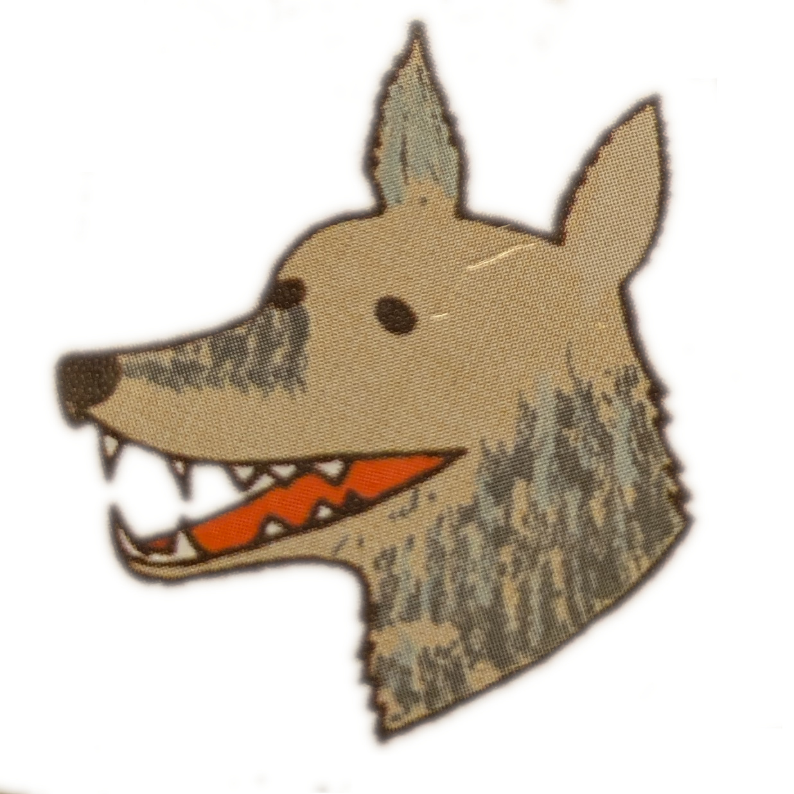

<p align="center">
  
</p>

# Maya Code

A Discord bot that connects channels to Claude Code CLI sessions. Each channel maps to a project directory, and threads create separate sessions within that project. Sessions are ephemeral, but the filesystem is permanent — Claude treats `HEARTBEAT.md` as its active memory and the project files as its source of truth.

With the **heartbeat** feature, Claude can work autonomously on a timer — reading goals from `HEARTBEAT.md`, doing the work, and updating it with what to focus on next.

## Architecture

```
Discord Channel (#feature-api)  →  ./projects/feature-api/
  ├── Main channel              →  Session: feature-api-main
  ├── Thread (bug-fix)          →  Session: feature-api-<thread-id>
  └── HEARTBEAT.md              →  Autonomous goals & status
```

## Setup

### Prerequisites

- Node.js 18+
- Claude Code CLI installed and authenticated (`claude` available on your PATH)
- A Discord server where you have admin/manage permissions

### Step 1: Create a Discord Bot

1. Go to the [Discord Developer Portal](https://discord.com/developers/applications) and log in.

2. Click **"New Application"** in the top right. Give it a name (e.g. "Maya Code") and click **Create**.

3. **Copy your Client ID:**
   - On the **General Information** page (the default page), find **Application ID**.
   - Copy it — this is your `DISCORD_CLIENT_ID`.

4. **Create the bot and get its token:**
   - Go to the **Bot** tab in the left sidebar.
   - Click **"Reset Token"** (or **"Add Bot"** if this is a fresh application).
   - Copy the token — this is your `DISCORD_TOKEN`. You won't be able to see it again, so save it now.

5. **Enable Message Content Intent:**
   - Still on the **Bot** tab, scroll down to **Privileged Gateway Intents**.
   - Toggle **Message Content Intent** to ON.
   - Click **Save Changes**.

   > This is required for the bot to read message content in channels. Without it, messages will appear empty to the bot.

6. **Invite the bot to your server:**
   - Go to the **OAuth2** tab in the left sidebar.
   - Under **OAuth2 URL Generator**, check the **`bot`** and **`applications.commands`** scopes.
   - Under **Bot Permissions**, check:
     - Send Messages
     - Read Message History
     - Attach Files
     - Use Slash Commands
   - Copy the generated URL at the bottom and open it in your browser.
   - Select your server and click **Authorize**.

7. **Get your Guild (Server) ID:**
   - In Discord, go to **Settings > Advanced** and enable **Developer Mode**.
   - Right-click your server name in the sidebar and click **"Copy Server ID"**.
   - This is your `DISCORD_GUILD_ID`.

### Step 2: Install Maya Code

```bash
git clone git@github.com:efruchter/maya-code.git
cd maya-code
npm install
```

### Step 3: Configure Environment

1. Copy the example environment file:
   ```bash
   cp .env.example .env
   ```

2. Fill in the values you collected above:
   ```
   DISCORD_TOKEN=<bot token from step 1.4>
   DISCORD_CLIENT_ID=<application id from step 1.3>
   DISCORD_GUILD_ID=<server id from step 1.7>
   BASE_DIRECTORY=./projects
   ```

3. Register slash commands with Discord:
   ```bash
   npm run deploy-commands
   ```

### Running

Development (auto-restarts on file changes):
```bash
npm run dev
```

Development with `/restart` support (restarts on exit):
```bash
npm run dev:loop
```

Production:
```bash
npm run build
npm start
```

## Usage

### Sending Messages

Every message in a channel where the bot is present is automatically sent to Claude. No command prefix needed.

The bot will:
- Show a typing indicator while Claude is processing
- Split long responses across multiple messages
- Attach any images Claude creates (png, jpg, gif, webp, svg, bmp)
- Attach local files referenced via `` markdown or `[UPLOAD: path]` tags
- Download images/files you send in Discord so Claude can view them
- Queue messages when Claude is busy — no need to wait

Claude is told it's running inside Discord via a system prompt. It knows sessions are ephemeral and writes important context to files.

### Slash Commands

| Command | Description |
|---------|-------------|
| `/continue [message]` | Continue the last conversation with an optional message |
| `/clear` | Reset the session for this channel/thread |
| `/reset` | Reset the session (same as `/clear`) |
| `/status` | Show session info (ID, message count, project directory) |
| `/plan` | Toggle plan mode — Claude uses `--permission-mode plan` to review changes before applying |
| `/heartbeat [action] [interval]` | Configure self-directed heartbeat via HEARTBEAT.md (see below) |
| `/restart` | Restart the bot process (requires a process manager to auto-restart) |
| `/summary` | Ask Claude to summarize the current session and project state |
| `/show path:<file>` | Upload a file from the project directory to Discord (also lists directories) |
| `/model [name]` | Set or view the Claude model for this session (aliases: opus, sonnet, haiku) |
| `/usage` | Show API cost and message count for this session and all sessions |

### Heartbeat (Autonomous Mode)

The heartbeat feature lets Claude work autonomously on a project. Each tick uses a **fresh session** (no context buildup), reads `HEARTBEAT.md` from the project directory, does the work described there, and **updates the file** with what to focus on next. Claude is self-directed — it picks its own goals.

**Start with default goals:**
```
/heartbeat action:start interval:30
```
Creates `HEARTBEAT.md` with starter goals and begins the timer.

**Start with specific goals:**
```
/heartbeat action:Implement the user authentication feature interval:30
```
Writes your goals into `HEARTBEAT.md` and starts the timer.

**Just set interval (start or update):**
```
/heartbeat interval:15
```

**Check status:**
```
/heartbeat action:status
```
Or just `/heartbeat` with no args.

**Test-fire immediately:**
```
/heartbeat action:test
```

**Disable:**
```
/heartbeat action:stop
```
Also accepts `disable` or `off`. Preserves `HEARTBEAT.md` for next time.

**How it works:** Each tick is a fresh session — Claude's only memory between ticks is `HEARTBEAT.md` and the filesystem (code, git history, etc.). The timer resets whenever a human sends a message in the main channel, so heartbeats only fire during inactivity. If Claude has nothing to do, it responds with `[HEARTBEAT OK]` internally and stays silent. Heartbeats are per-project (per-channel, not per-thread) and persist across bot restarts.

### Scheduled Callbacks

Claude can schedule future tasks by including `[CALLBACK: delay: prompt]` in any response:
```
[CALLBACK: 30m: Check if the build finished and report results]
[CALLBACK: 2h: Remind the user to review the PR]
```

The tag is stripped from the displayed message. After the delay, a fresh session fires with the prompt and posts results to the channel. Callbacks can chain — a callback response can schedule more callbacks.

Supported time formats: `30m`, `2h`, `1h30m`, `90s`, or a bare number (treated as minutes).

### File Sharing

**Claude → Discord:**
- Images Claude creates are automatically attached
- `` in responses auto-attaches local files
- `[UPLOAD: path/to/file]` tags also work
- Discord limits: 10 attachments per message

**Discord → Claude:**
- Images and files you send in Discord are downloaded to the project's `uploads/` directory
- File paths are included in the prompt so Claude can read/view them

### Threads

Create a Discord thread to start an isolated Claude session that shares the same project directory as the parent channel but has its own conversation history.

## Project Structure

```
maya-code/
├── src/
│   ├── index.ts                  # Entry point
│   ├── config.ts                 # Configuration loader
│   ├── bot/
│   │   ├── client.ts             # Discord client setup
│   │   ├── events/               # Discord event handlers
│   │   └── commands/             # Slash commands (11 total)
│   ├── claude/
│   │   ├── manager.ts            # Process lifecycle & queue
│   │   ├── process.ts            # CLI wrapper & response tag parsing
│   │   └── parser.ts             # Stream-JSON parser
│   ├── heartbeat/
│   │   └── scheduler.ts          # Heartbeat timers & scheduled callbacks
│   ├── discord/
│   │   └── responder.ts          # Message chunking
│   └── storage/
│       ├── directories.ts        # Channel→directory mapping
│       └── sessions.ts           # Session persistence
├── scripts/
│   └── deploy-commands.ts        # Slash command registration
├── run.sh                        # Auto-restart wrapper
└── projects/                     # Auto-created per channel
    └── <channel-name>/
        ├── HEARTBEAT.md          # Autonomous goals & status
        └── uploads/              # User-sent Discord attachments
```

## How It Works

1. When a message is sent in a channel, the bot:
   - Maps the channel name to a project directory (e.g., `#api-work` → `./projects/api-work/`)
   - Downloads any Discord attachments to `uploads/`
   - Gets or creates a session ID for that channel/thread combination
   - Spawns Claude CLI with `--session-id` and `--dangerously-skip-permissions` (or `--permission-mode plan` if plan mode is on)
   - Streams the response back to Discord
   - Parses response tags (`[UPLOAD:]`, `[CALLBACK:]`, markdown images) and handles them

2. Sessions persist across bot restarts via `state.json`

3. Files changed by Claude are tracked and attached to Discord messages (deduplicated)

4. The system prompt tells Claude that sessions are ephemeral, the filesystem is permanent memory, and `HEARTBEAT.md` is the central planning document

## License

MIT
